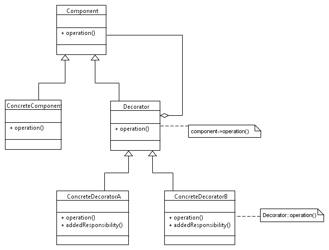

----------------------------------------------------------------------------------------------------------------
# The Decorator Pattern

### Sources:
Notes below regarding decorator pattern taken from "Design Patterns - Elements of Reusable Object-Oriented Software"
By Gamma, Helm, Johnson, Vlissides

Example Code provided by Derek Banas:
Tutorial: https://www.youtube.com/watch?v=j40kRwSm4VE
Source Code: http://www.newthinktank.com/2012/09/decorator-design-pattern-tutorial/

### Author: Justin J

### Purpose: FAU Object Oriented Software Design Course, Sprint 2017

----------------------------------------------------------------------------------------------------------------

## Intent
- Attach additional responsibilities to an object dynamically
- provide a flexible alternative to subclassing for extending functionality

## Also Known As
- Wrapper

## Motivation
- sometimes there is need to add responsibility to specific object, but not an entire class
- inheritance is static and must be done pre-compilation
- more flexible -> enclose the object in another object that adds desired functionality
	- enclosing object is the decorator
	- decorators presence is transparent because it conforms to object's interface
- decorators can be nested recursively

## Applicability
- to add responsibilities to individual objects dynamically and transparently, without side effects
- for responsibilities that can be withdrawn
- when extension through subclassing is impractical

## Structure
 

## Participants
#### Component
- defines the interface for objects that can have responsibilities added to them dynamically
#### Concrete Component
- defines an object to which additional responsibilities can be attached
#### Decorator
- maintains a reference to a Component object and defines an interface that conforms to Component's interface
#### Concrete Decorator
- adds responsibilities to the component

## Collaborations
- Decorator forwards requests to its Component object
	- may perform additional operations before/after forwarding the request

## Consequences
- More flexibility than static inheritance
	- add/remove responsibility at run time
	- providing different Decorator classes lets you mix and match responsibilities
- Avoids feature-laden classes high up in the hierarchy
	- define simple class and add functionality incrementally as needed
- A decorator and its component aren't identical
	- it acts as transparent enclosure, but from object identity point of view, a decorated component is not identical to the component itself
	- don't rely on object identity when using decorations
- Lots of little objects
	- often results in systems composed of lots of little objects that all look alike
	- can be difficult to learn and debug at first

## Implementation
- Interface Conformance
	- interface must conform to inerface of component it decorates
	- Concrete decorator must therefore inherit from a common class-
- Omitting abstract Decorator class
	- no need to define an abstract Decorator class when you only need to add one responsibility
- Keeping component classes lightweight
	- to ensure a conforming interface, components and decorators must descend from a common Component class
	- must keep this common class lightweight, focus on defining interface, not on storing data
- Changing the skin of an object vs chaning its guts
	- change the skin over an object, but don't change all the guts. Use strategy pattern for changing guts
	- since the decorator pattern only changes a component from outside, the component doesn't have to know anything about it's decorators
		- decorators are transparent to the component
		
## Related Patterns
- adapter
- composite
- strategy
